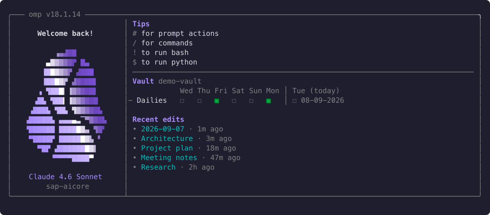

# obsidian-welcome

Animated Obsidian-aware startup widget for omp.



The plugin activates only when the omp working directory is inside an Obsidian vault. It asks the Obsidian CLI for the active vault first and verifies that the working directory belongs to it. If the CLI is unavailable, fails, or points at another vault, it finds the nearest ancestor containing `.obsidian`. Sessions started in vault subdirectories work without project configuration.

The widget shows:

- A three-second purple gradient and shine animation over the Obsidian logo
- The detected vault name and current subdirectory when below the vault root
- The active model and provider
- Daily-note status for the last seven days
- Five most recently edited Markdown notes with their edit age
- OMP input shortcuts

Files under `Private/` never appear in recent edits. The widget disappears on first input and releases its animation timer.

## Install

```text
omp plugin install obsidian-welcome@erikh3-omp-marketplace
```

Restart omp after installation. The plugin needs no project-local extension.

Disable omp's built-in welcome screen in the vault's `.omp/config.yml` to show only the Obsidian widget:

```yaml
startup:
  quiet: true
```

## Development

```text
bun install
bun run typecheck
omp plugin link ./plugins/obsidian-welcome
```

Regenerate the README animation from the fake vault in `demo-vault/`. The script requires ImageMagick (`brew install imagemagick`).

```text
bun run demo
```

The generator renders the real welcome component into deterministic SVG frames and uses ImageMagick to create `assets/welcome.gif`. It does not record the desktop or require manual capture.
