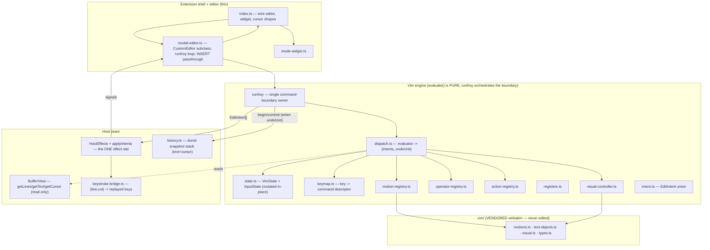

# pi-vim architecture (ground-up redesign)

Design for a ground-up internal re-architecture of the `pi-vim` plugin.

**Status: implemented.** The refactor is complete; the as-built module layout matches §8 (`src/engine/`, `src/host/`, `src/ex/`, vendored `src/vim/`).

**Hard contract: behavior-preserving.** The 698-test suite under
`plugins/pi-vim/test/` (see `docs/test-architecture.md`) is the regression
oracle. This redesign changes *internal structure only* — no observable
keystroke behavior changes. Every migration step keeps `bun test` and
`bun run typecheck` green. The vendored `src/vim/{motions,text-objects,visual,types}.ts`
files stay **byte-identical** (MIT, re-vendored only — never edited).

> **Revised after review.** This is v2, incorporating three independent
> critiques (design, vim-domain fidelity, migration feasibility). The material
> changes from v1 are summarised in §13.

---

## 1. Motivation

`src/modal-editor.ts` is a **1441-line monolith** (`ModalVimEditor extends
CustomEditor`) that fuses every concern of the editor into one class. Concrete
evidence (from the current source):

- `#handleNormalKey` — **264 LOC, 50+ `case` branches** (mode switches, motions,
  operators, char-find, repeat, paste, undo, ex, text-objects) in a single
  `switch`. Every new NORMAL command edits this method.
- `#handleOperatorKey` — **128 LOC**, a *second* dispatch that re-resolves
  motions as operator targets. Charwise motions funnel through the shared
  `#applyCharwiseTarget`, which branches on `#op` to decide move-vs-delete-vs-yank;
  the standalone `w` and the operator-target `w` call the *same* method. Motion
  logic is **duplicated** and **entangled with operator state**.
- **A 7-field implicit state machine** — `#mode`, `#count`, `#op`, `#textObject`,
  `#charPending`, `#replacePending`, `#pendingG` (plus `#lastCharMotion`,
  `#visualAnchor`). Invariants live in comments, not types; `#resetPending`
  clears six fields by hand; mutations are scattered across 20+ methods.
- **No "command-complete" boundary.** A command's end is never represented, so
  `.` repeat is structurally impossible to add without instrumenting every path.
- **Operator dispatch is hardcoded cases**, not a registry — adding `>`/`<`
  indent touches `#handleNormalKey`, `#handleOperatorKey`, `#handleVisual`, the
  `Operator` union, and a new method.

Already-good subsystems (keep their boundaries): the undo/redo timeline is
cohesive; the vendored pure-function core is clean and correct; and — confirmed
by the migration review — **no test reaches a private field or `#method`**: the
16 integration test files assert only observable state (`ed.mode`, `getText`,
`getCursor`, and the five host callbacks). Decomposition therefore cannot break
the integration suite on internals — a major de-risker for this rewrite.

### Goals

1. **Extensibility as one-line table rows.** A new motion, operator, text-object,
   action, or ex command should be a registry entry plus a keymap row — not an
   edit to a 264-line `switch`.
2. **Explicit state machine.** One typed `VimState` with named transitions
   replaces seven implicit fields.
3. **Resolve a motion once.** A shared motion registry + operator registry feed
   NORMAL, OPERATOR-PENDING, and VISUAL from one resolution — killing the
   duplication. (This is the concrete de-duplication cure; see §3.)
4. **A first-class command boundary** with a single owner, so `.` repeat, named
   registers, and dot-repeatable operators become cheap.
5. **A narrow, testable host seam** hiding omp's keystroke-replay constraint.
6. **Files small enough to hold in context** — each unit one responsibility.

### Non-goals

- No new vim features in the rewrite itself (they land *after*, on the new
  seams). YAGNI: we build the seams the near-term features need, not a full vim.
- No change to INSERT mode: it remains the stock omp editor, untouched.
- No change to the vendored pure-function logic.
- No new runtime dependency (Bun + `@oh-my-pi/*` peer deps only).

---

## 2. Constraints (the shape the design must fit)

- **omp `CustomEditor` exposes no cursor setter.** The base editor moves the
  cursor only by **replaying one grapheme-worth of arrow/delete key per press**.
  All cursor movement is keystroke replay. This must be hidden behind one seam.
  The replay loop lives **today in `modal-editor.ts` as `#moveToAbs`** (not in
  `bridge.ts`); the redesign *extracts* it.
- **INSERT mode = the stock editor.** In INSERT the plugin forwards everything to
  the base editor (typing, paste, history, autocomplete, submit). Only `Esc` and
  the mode transitions are ours. The shell catches `Esc` *before* the engine
  sees it; every other INSERT byte — including multi-byte paste sequences that
  may themselves contain `\x1b` — is forwarded to the base editor whole.
- **Vendored verbatim.** `vim/motions.ts`, `vim/text-objects.ts`,
  `vim/visual.ts`, `vim/types.ts` are MIT copies of `lajarre/pi-vim`. Pure
  functions in UTF-16 offset space. Never edited in place.
- **Host callbacks are the only UI surface**: `onModeChange`, `onExCommandChange`,
  `runExCommand`, `notifyUser`, `getCommandNames` (wired in `index.ts`).
- **Undo granularity is asserted by tests** (INSERT commits **per keystroke**;
  a completed NORMAL command commits **once**; a no-op like `p` with an empty
  register commits **nothing** — smoke #29–#39). The rewrite must preserve all
  three.
- **Effect order within one command is load-bearing.** e.g. `o` = move-to-EOL →
  set INSERT → insert `\n`; `c`-family = delete → set INSERT; paste = insert →
  step cursor back; INSERT-exit = set NORMAL → step left. Any reordering is an
  observable regression.
- **tsconfig is strict.** `strict: true`, `verbatimModuleSyntax: true`,
  `allowImportingTsExtensions: true`. Partial-refactor states must still
  typecheck; type-only imports must be `import type`.

---

## 3. Approaches considered

### A — Declarative vim engine: grammar + registries + read/effect seam (RECOMMENDED)

Model the plugin the way the mature open-source vim engine
(`@replit/codemirror-vim-core`) and vim itself are modelled:

- **named registries** of motions / operators / actions (functions keyed by name),
- a **declarative keymap** mapping keys → command descriptors,
- an **`InputState` accumulator** + a small **evaluator** that recognises the
  grammar `[count][register][operator][count][motion|text-object]` (or
  `[count]action`), plus a handful of special forms (§5.11.1),
- a **read port (`BufferView`)** the pure engine reads through, and a single
  **effect applier** that turns the engine's declarative `EditIntent[]` into omp
  keystroke replays / edits.

**What actually cures which pain.** The *duplication* (§1) is cured by two
pieces — a **shared motion registry** that resolves a motion once into a
`MotionResult` reused by all three contexts, and an **operator registry** keyed
by name. The full **grammar/evaluator** earns its keep specifically for
count-composition (`2d3w`), the register selector (`"a`), and the explicit
**command boundary** (which unlocks `.` and clean undo) — *not* for
de-duplication per se. We state this honestly so expectations and risk are
right-sized: the evaluator is the highest-churn new unit.

*Pros:* extensibility becomes table rows; motions resolve once; one owner for the
command boundary; the host constraint is isolated and mockable; units are
independently testable. Matches the domain (vim *is* a small language). *Cons:*
higher up-front refactor; the evaluator concentrates risk; table dispatch is less
immediately greppable than a `switch` (mitigated by one canonical `keymap.ts`).

### B — Modular decomposition, no grammar

Split the monolith into per-concern classes but keep `switch`-style dispatch.
*Pros:* lowest risk, least churn. *Cons:* keeps the implicit multi-field state
and gives **no** command boundary, so `.`/named registers stay expensive; per-mode
switches still grow per feature. Note: B's *shared motion resolver* + *operator
registry* already kill the duplication — we adopt exactly those inside A.

### C — Adopt a full external vim engine behind an adapter

Rejected. Concretely, the strongest candidate is `@replit/codemirror-vim-core`
(the editor-agnostic vim engine also cited as the design model for A). It is
agnostic across *real code editors*, not prompt boxes, and that is the whole
problem. See the build-vs-reuse analysis below for why the impedance is
prohibitive here; in short: it assumes a synchronous document/cursor API omp
does not expose, ships a large surface irrelevant to a prompt box, fights the
698-test behavior contract, and adds a heavy dependency to a plugin that today
has none.

### Build vs. reuse: where the reuse boundary falls

This is a hybrid, and the boundary is deliberate. The decision rule is
**portability**, and portability is decided by one fact from §2: omp's
`CustomEditor` **has no cursor setter** and moves only by replaying grapheme
keystrokes. Every concern a vim library touches divides cleanly along that line.

**Portable, so reuse it: the motion / text-object / visual *math*.** Pure
functions over `(lines, cursor)` in UTF-16 offset space. This is the hard,
bug-prone part (unicode grapheme boundaries, nested text-object resolution,
inclusive/exclusive motion rules). We reuse it by **vendoring** `lajarre/pi-vim`'s
`vim/{motions,text-objects,visual,types}.ts` verbatim (MIT), refreshed only by
re-vendoring. Vendoring (not an npm dependency) is right for a small, stable pure
surface from an upstream that is not a published standalone package: byte-stable,
version-churn-free, license-clean, tiny.

**Non-portable, so build it: the dispatch / host layer.** Mode state machine,
operator application, undo timeline, `:` routing to omp's palette, and above all
the keystroke bridge. This layer *encodes the host editor's capabilities*, so it
cannot be borrowed from an editor with a different model. This is exactly why
pi-vim vendored only lajarre's pure functions and wrote its own dispatch:
lajarre's dispatch is coupled to *its* host, not portable. It is also why we
cannot simply take more of lajarre, or take CM-vim's engine.

**Why the vendored reuse beats any third-party engine.** `lajarre/pi-vim` is a
sibling prompt-vim for the same host family, so its pure functions already speak
the correct coordinate model (grapheme / UTF-16 offsets on a prompt buffer).
`@replit/codemirror-vim-core` speaks CodeMirror's document model
(`getCursor`/`setCursor`/`replaceRange`/`markText`/`operation`). Adopting it
would mean implementing that entire cursor-addressable document API on top of a
textbox we can only feed injected keystrokes, and every cursor move would *still*
bottom out in our keystroke bridge. Add the scope mismatch (marks, jumplists,
macros, `:g`, search-highlight, folding, visual-block are irrelevant or wrong in
a prompt box where INSERT is the stock omp editor), the behavior-contract fight
(the 698 tests pin omp-specific behavior such as the `<Esc>` left-step and exact
paste-cursor rest, which CM-vim would not match), and a heavy new dependency, and
the trade is clearly negative. No other mature engine fits better: Ace, Monaco-vim
and CM-vim all target cursor-addressable editors; readline vi-modes are far too
shallow (no operators / text-objects).

**The one condition that flips the decision.** If the roadmap became
*editor-grade* vim (macros, marks, jumplists, full ex language, `:g`,
search-highlight, visual-block, full-fidelity dot-repeat), reimplementing all of
that from scratch is a large, bug-prone effort that CM-vim has already
battle-tested, and building the omp document-model adapter once could amortize.
But pi-vim's scope is a prompt editor whose near-term wishlist is small (named
registers, `.` repeat, an indent operator), and the registries in A make each of
those a table row. For that delta the hybrid wins decisively. Revisit this
section if the scope ever crosses into editor-grade vim.

**Decision: Approach A**, using **B's module boundaries as the physical file
layout** (small, cohesive files). Grammar/evaluator = extensibility + command
boundary; module split = readability; shared registries = de-duplication.

---

## 4. Architecture overview

Ports-and-adapters around a pure vim engine. The engine **reads** through a
narrow `BufferView` and **writes nothing directly** — it returns `EditIntent[]`
that a single applier performs.



**One-sentence data flow:** a key enters `modal-editor.handleInput` →
`runKey(state, host, key)` calls the **pure evaluator** (which reads `BufferView`,
mutates engine-internal `VimState`, and returns `{intents, undoUnit}`); `runKey`
then, *only when `undoUnit`*, brackets `History.begin/commit` around a single
`applyIntents` call that performs the intents **in strict emission order**.

The engine never calls omp APIs and never emits keystrokes; it returns data. That
inversion confines the "no cursor setter" constraint to one file and makes every
engine unit unit-testable by asserting the returned `EditIntent[]`.

---

## 5. Components

Each unit states **what it does / its interface / what it depends on.**

### 5.1 Vendored pure core — `src/vim/{motions,text-objects,visual,types}.ts`
- **What:** pure motion / text-object / visual-geometry functions in UTF-16
  offset space. Unchanged.
- **Depends on:** nothing. Never imports engine code (keeps re-vendoring clean).

### 5.2 Read port — `BufferView` (in `src/host/adapter.ts`)
- **What:** the *only* surface the pure engine reads through.
  ```ts
  interface BufferView {
    getLines(): readonly string[];
    getText(): string;
    getCursor(): Pos;            // { line, col } in grapheme coords
  }
  ```
- **Depends on:** vendored `types.ts`.
- **Why:** motions, the visual controller, and the ex parser take `BufferView` —
  not a write-capable object. A unit's parameter advertises exactly the
  capability it may use; nothing can accidentally mutate the buffer mid-read.

### 5.3 Effect applier — `HostEffects` + `applyIntents` (in `src/host/adapter.ts`)
- **What:** the single place that performs effects. The engine never calls these;
  `applyIntents` does.
  ```ts
  interface HostEffects extends BufferView {
    moveCursor(to: Pos): void;            // via keystroke bridge (no setter)
    replaceRange(range: AbsRange, text: string): void; // insert = empty range
    forward(data: string): void;          // INSERT passthrough to base editor
    signalMode(mode: VimMode): void;       // -> onModeChange (widget + cursor shape)
    signalEx(buffer: string | null): void; // -> onExCommandChange
    runEx(line: string): void | Promise<void>;
    notify(message: string): void;
    getCommandNames(): ReadonlySet<string>;
  }
  function applyIntents(host: HostEffects, intents: EditIntent[]): void;
  ```
- **Contract:** `applyIntents` executes intents in **strict emission order, one at
  a time, with no batching or reordering across kinds.** This preserves the
  load-bearing sequences of §2 (`o`, `c`-family, paste, INSERT-exit).
- **Depends on:** `intent.ts`, `keystroke-bridge.ts`.
- **Note:** there is exactly one effect vocabulary now — `EditIntent`. The
  applier's methods are its private mechanism, not a second public port. (v1
  carried both; see §13.)

### 5.4 Keystroke bridge — `src/host/keystroke-bridge.ts`
- **What:** the coordinate converters from today's `src/vim/bridge.ts`
  (`lineColToAbs`, `absToLineCol`, `graphemeCount`, `graphemeSteps`) **plus** the
  replay loop **extracted from `modal-editor.ts`'s `#moveToAbs`** (the loop is not
  in `bridge.ts` today). Moved out of `vim/` because it is *our* code, not
  vendored — its current location falsely implies otherwise.
- **Interface:** `moveCursor(view, to)` computing and forwarding the arrow/delete
  keys, plus the converters.
- **Behavior to preserve exactly:** line delta first (up/down), then column delta
  (left/right); EOL over-shoot is clamped by the base editor; the `<Esc>`
  left-step on INSERT→NORMAL. These get dedicated round-trip unit tests over the
  unicode fixtures before the loop is relocated.
- **Depends on:** vendored `motions.ts` (`getLineGraphemes`) only.

### 5.5 Edit intents — `src/engine/intent.ts`
- **What:** the declarative vocabulary the engine returns. Discriminated union:
  ```ts
  type EditIntent =
    | { kind: "moveCursor"; to: Pos }
    | { kind: "replaceRange"; range: AbsRange; text: string } // delete = "", insert = empty range
    | { kind: "setMode"; mode: VimMode }
    | { kind: "setExBuffer"; value: string | null }
    | { kind: "runEx"; line: string }
    | { kind: "notify"; message: string }
    | { kind: "forward"; data: string };
  ```
- **Depends on:** vendored `types.ts`.
- **Note:** `replaceRange` is the single edit primitive; there is no separate
  `insert`/`delete`/`insertAtCursor` (they are special cases of it). Emitting a
  `setMode` intent both records the transition for the host UI and lets the
  applier order it relative to edits within one command.

### 5.6 Vim state — `src/engine/state.ts`
- **What:** one explicit, **mutable, single-owner** structure replacing the 7
  scattered private fields. Engine units mutate it in place through a `ctx`;
  reads of the *buffer* still go through `BufferView`.
  ```ts
  interface VimState {
    mode: VimMode;                     // normal | insert | visual | visual-line
    input: InputState;                 // the pending command being built
    visualAnchor: Pos | null;
    registers: RegisterFile;
    lastChange: RecordedCommand | null;      // for `.` repeat
    lastCharMotion: { motion: CharMotion; char: string } | null; // for ; ,
    exBuffer: string | null;
  }
  interface InputState {
    count: string;                     // digit prefix ("" = none)
    operator: OperatorName | null;
    register: string | null;           // named-register selector after `"`
    pending: "char" | "textobject" | "replace" | "g" | "register" | null;
    keys: string[];                    // raw keys of the in-flight command
  }
  type RecordedCommand = { keys: readonly string[] }; // replayed verbatim by `.`
  ```
- **Mutation semantics (decided):** state is a **mutable object owned by the
  engine**; `ctx = { state, view }` is passed to registries/actions, which mutate
  `state` (register, anchor, pending, mode, counts) and *return* `EditIntent[]`.
  History is **not** part of `VimState` — it is a host-seam concern driven only by
  `runKey` (§5.11), keeping the undo owner singular.
- **`RecordedCommand`:** the completed command's raw key sequence. On completion of
  a *mutating* NORMAL command the evaluator copies `input.keys` into
  `state.lastChange`; `.` re-feeds those keys through `runKey`. (It is the same
  capture as `input.keys`, snapshotted at the boundary — not a second scheme.)
- **Interface:** pure helpers `resetInput`, `takeCount`, `hasPending`.
- **Why:** the invariants the scout found in comments (`operator set ⇒ awaiting
  motion`) become the shape of `InputState`, with one reset.

### 5.7 Motion registry — `src/engine/motion-registry.ts`
- **What:** named motions, thin wrappers over the vendored pure functions.
  ```ts
  interface MotionResult { target: Pos; inclusive: boolean; linewise: boolean; }
  type Motion = (view: BufferView, count: number, arg?: string) => MotionResult | null;
  const motions: Record<MotionName, Motion>;  // h l w b e 0 ^ $ f F t T % gg G ...
  ```
- **Depends on:** vendored `motions.ts` + `text-objects.ts`; `BufferView`.
- **Resolve-once, interpret-per-context:** a motion computes **one**
  `MotionResult`. The **evaluator** interprets it by context: standalone → move
  cursor to `target`; under an operator → build the `AbsRange` from cursor to
  `target`, honouring `inclusive`/`linewise`; in VISUAL → extend the selection to
  `target`. The `inclusive`/`linewise` flags carry vim's exclusive/inclusive
  distinction (`w` exclusive vs `e` inclusive) so `dw` and `de` differ correctly.
  Named in §5.11.1: `cw` is special-cased to behave like `ce`.

### 5.8 Operator registry — `src/engine/operator-registry.ts`
- **What:** named operators over a resolved range.
  ```ts
  type Operator = (ctx: Ctx, range: AbsRange, linewise: boolean) => EditIntent[];
  const operators: Record<OperatorName, Operator>; // d c y (later > < gu gU ...)
  ```
- **Depends on:** `registers.ts` (yank on delete/yank), `intent.ts`.
- **Why:** `>`/`<` becomes one entry each and works in NORMAL operator-pending and
  VISUAL because both feed the same `(range, linewise)`.

### 5.9 Action registry — `src/engine/action-registry.ts`
- **What:** commands that are not operator+motion: mode entries (`i a I A o O v V
  :`), `x s r`, `p P`, `u Ctrl+r`, `. ; ,`, doubled operators `dd cc yy` (§5.11.1),
  visual `o`.
  ```ts
  type Action = (ctx: Ctx, count: number) => EditIntent[];
  const actions: Record<ActionName, Action>;
  ```
- **Depends on:** `registers.ts`, `visual-controller.ts`, `intent.ts`.

### 5.10 Keymap — `src/engine/keymap.ts`
- **What:** the declarative dispatch table, per mode, replacing the giant switch.
  ```ts
  type Command =
    | { type: "motion"; name: MotionName; arg?: "await-char" }
    | { type: "operator"; name: OperatorName }
    | { type: "action"; name: ActionName }
    | { type: "textobject"; name: TextObjectName };
  const keymap: Record<VimMode, Record<string, Command>>;
  ```
- **Depends on:** registry name types only (no logic). The one file a contributor
  reads to see "what keys exist."

### 5.11 Evaluator + boundary owner — `src/engine/dispatch.ts`
- **What (pure evaluator):** `evaluate(ctx, key): { intents: EditIntent[]; undoUnit: boolean }`:
  1. INSERT → `{ intents: [{kind:"forward", data:key}], undoUnit: true }` (the
     diff-guard, §5.13, collapses non-mutating forwards). `Esc` never reaches
     here — the shell handles it.
  2. EX → route to ex buffer handling (§5.15).
  3. Else accumulate into `InputState` (digits→count; `"`→register selector;
     operator key→operator; `f/F/t/T`/`r`/`g`/`i`/`a`→`pending`). Incomplete →
     `{ intents: [], undoUnit: false }`.
  4. On a **complete** command per the grammar (or a special form, §5.11.1),
     resolve the motion→`AbsRange` (once), run the operator or action, produce
     intents. In VISUAL the selection *is* the range.
  5. On completion of a **mutating** command, copy `input.keys`→`state.lastChange`
     and return `undoUnit: true`; a pure motion / mode switch returns
     `undoUnit: false`.
- **What (`runKey` — the single boundary owner):**
  ```ts
  function runKey(state, host, key): void {
    const { intents, undoUnit } = evaluate({ state, view: host }, key);
    if (undoUnit) history.begin(host.getText(), host.getCursor());
    applyIntents(host, intents);                 // strict emission order
    if (undoUnit) history.commit(host.getText(), host.getCursor()); // no-op if text unchanged
  }
  ```
  **This is the ONLY place `History.begin/commit` is called.** `dispatch`,
  `applyIntents`, `history`, and the applier never touch the timeline otherwise.
  A mid-command `setMode` cannot split the unit because `begin`/`commit` bracket
  the *whole* intent list.
- **Depends on:** all registries, `state.ts`, `visual-controller.ts`, `intent.ts`,
  `history.ts`, `BufferView`.

#### 5.11.1 Special forms (explicitly modelled, not left to the generic grammar)
- **`cw` → `ce`:** when the operator is `c` and the motion is `w`/`W` on a
  non-blank, change through the *end* of the word (vim's quirk), not to the next
  word-start. Handled in the evaluator's operator+motion step.
- **`gg` / `G`:** first `g` sets `pending: "g"`; second `g` completes `gg`
  (goto-line). `G` is a plain motion. Modelled via `pending`.
- **Doubled operators `dd` / `cc` / `yy`:** recognised as *actions* (linewise
  operate on `count` whole lines), keyed in `keymap` — not "operator then motion".
- **Visual `o`:** an action that swaps `visualAnchor` with the live cursor so the
  next motion extends from the other end.
- **`;` / `,`:** actions that replay `state.lastCharMotion` (forward / reversed),
  preserving the `t`-motion till-offset exactly as today.

### 5.12 Registers — `src/engine/registers.ts`
- **What:** `RegisterFile` — the unnamed register today, keyed storage ready for
  named registers (the `input.register` selector already exists).
  ```ts
  interface Register { text: string; linewise: boolean; }
  class RegisterFile { get(name?: string): Register | null; set(reg, name?): void; }
  ```
- **Depends on:** nothing.

### 5.13 History — `src/host/history.ts`
- **What:** the undo/redo timeline, dumb and driven solely by `runKey`.
  ```ts
  interface Snapshot { text: string; line: number; col: number; } // cursor included
  begin(text, cursor): void;   // record pre-command snapshot
  commit(text, cursor): void;  // push one unit; NO-OP if text === pre-command text
  undo(): Snapshot | null;     // restores text AND cursor
  redo(): Snapshot | null;
  ```
- **Contract:** one `commit` per `runKey` call that flagged `undoUnit`; the
  text-equality guard makes non-mutating commands (a `p` on an empty register,
  a motion that landed nowhere) push nothing — exactly today's `#commitChange`
  behavior. INSERT keystrokes each get their own `begin/commit` (per-keystroke
  units) because each is its own `runKey`.
- **Depends on:** nothing (operates on snapshots).

### 5.14 Visual controller — `src/engine/visual-controller.ts`
- **What:** owns `visualAnchor` reads, computes the selection range from anchor +
  cursor via the vendored `visual.ts`, and the `o` end-swap.
  ```ts
  function selectionRange(state, view): { range: AbsRange; linewise: boolean };
  ```
- **Depends on:** vendored `visual.ts`; `BufferView`.
- **Why:** the range it returns feeds the *same* operator registry NORMAL uses.

### 5.15 Ex subsystem — `src/ex/parser.ts` + `src/ex/commands.ts`
- **What:** replaces the 3 tangled methods (`#handleEx`/`#submitEx`/`#dispatchEx`).
  - `parser.ts`: `parseExLine(line): { name, args } | { search }`.
  - `commands.ts`: a registry of ex commands (`q`, reserved-name precedence,
    search, palette fallback), returning `EditIntent[]` (typically a single
    `runEx`).
- **Async restore stays host-side.** Today `#dispatchEx` re-`setText`s / restores
  the cursor *after* the `runExCommand` promise settles (some hosts clear the
  buffer on await). This is pure omp-side buffer bookkeeping, **not** vim logic
  and **not** an undo unit. It lives in the applier's `runEx` handling (which may
  `await`), outside the synchronous engine and outside `runKey`'s undo bracket.
- **Depends on:** `HostEffects` (`runEx`, `notify`, `getCommandNames`).

### 5.16 ModalVimEditor shell — `src/modal-editor.ts`
- **What:** shrinks from 1441 LOC to a thin `CustomEditor` subclass. Owns the
  `VimState`, implements `HostEffects` bound to `this`, and:
  ```ts
  handleInput(data) {
    if (this.#mode === "insert" && isEscape(data)) { /* Esc -> NORMAL, left-step */ return; }
    runKey(this.#state, this /* HostEffects */, data);
  }
  ```
  Plus the `on*`/`runExCommand`/`getCommandNames` wiring the base class expects.
  The INSERT `forward` path routes through the same `runKey` (per-keystroke undo
  units via the diff-guard).
- **Depends on:** engine + host modules; base `CustomEditor`.

### 5.17 Extension shell — `src/index.ts` + `src/mode-widget.ts`
- **Unchanged responsibility:** register the editor, mount `ModeWidget`, map
  `VimMode`→DECSCUSR cursor shapes, forward `onModeChange`/`onExCommandChange`.
  The `runExCommand → sendUserMessage` wiring stays. No structural change beyond
  importing the new editor.

---

## 6. Data flow & the undo model

```
key ─▶ modal-editor.handleInput
        │  (INSERT + Esc handled here, before the engine)
        ▼
   runKey(state, host, key)                       ← the ONE undo-boundary owner
        │  { intents, undoUnit } = evaluate(...)  ← PURE: reads BufferView, mutates VimState
        │  if undoUnit: history.begin(text, cursor)
        │  applyIntents(host, intents)            ← STRICT emission order
        │     ├ moveCursor    → keystroke-bridge → replayed arrow keys (no undo entry)
        │     ├ replaceRange  → base edit
        │     ├ setMode       → host.signalMode → widget + cursor shape
        │     ├ setExBuffer   → host.signalEx
        │     ├ runEx         → host.runEx (may await; owns async restore)
        │     └ forward       → base editor (INSERT passthrough)
        │  if undoUnit: history.commit(text, cursor)  ← NO-OP if text unchanged
        ▼
   (on completed mutating NORMAL command: state.lastChange = input.keys, for `.`)
```

**Unified undo rule (single sentence):** `runKey` opens exactly one History unit
whenever the evaluated key *could* mutate the buffer (`undoUnit`: every INSERT
`forward`, every completed mutating NORMAL command) and the text-equality guard
in `history.commit` discards the ones that didn't change anything. This yields:
INSERT = one unit per keystroke; `dw` = one unit; `p` on empty register = zero
units — matching smoke #29–#39 without any text-diffing scattered through the
code. **Ordering oracle for tests:** `o`, `cw`, `s`, and visual-paste are the
cases that pin strict effect ordering; they must be exercised the moment the
evaluator lands.

---

## 7. Extensibility — worked examples

The exact three features the scout showed are expensive today, on the new seams:

**New motion (`H`/`M`/`L`)** — 1 entry in `motion-registry.ts` + 1 row in
`keymap.ts`. Works standalone, under operators, and in visual for free.

**Indent operator `>` / `<`** — 1 entry each in `operator-registry.ts` (compute
the whitespace edit over `(range, linewise)`) + 2 `keymap` rows. Available in
NORMAL operator-pending *and* VISUAL automatically. No `switch` edits.

**Named registers (`"ay`, `"ap`)** — `input.register` and the `"` `pending` case
already exist; `RegisterFile.get/set` already take a name. Yank/delete/paste read
the selector. No new cross-cutting field, no `resetInput` surgery.

**`.` repeat** — `state.lastChange` records the completed command's keys at the
evaluator boundary; the `.` action re-feeds them through `runKey`. The "missing
command boundary" that blocks this today is now a first-class concept.

---

## 8. File structure

```
src/
  index.ts                     # extension shell (wire editor/widget/cursor) — thin
  mode-widget.ts               # unchanged
  modal-editor.ts              # thin CustomEditor subclass: state + HostEffects + runKey wiring
  engine/
    dispatch.ts                # evaluator + runKey (the boundary owner)
    state.ts                   # VimState + InputState + RecordedCommand + transitions
    keymap.ts                  # declarative key -> command tables per mode
    motion-registry.ts         # named motions (wraps vendored motions/text-objects)
    operator-registry.ts       # named operators (d/c/y; later >,<,gu,...)
    action-registry.ts         # named actions (i/a/o/p/u/x/s/r/;/,/./dd/cc/yy/visual-o)
    registers.ts               # RegisterFile (unnamed + named-ready)
    visual-controller.ts       # visual selection geometry (wraps vendored visual)
    intent.ts                  # EditIntent union
  host/
    adapter.ts                 # BufferView + HostEffects + applyIntents (the one effect site)
    keystroke-bridge.ts        # (line,col) -> keystroke replay (bridge.ts converters + extracted #moveToAbs)
    history.ts                 # dumb undo/redo snapshot stack (text + cursor)
  ex/
    parser.ts                  # ex command-line parser
    commands.ts                # ex command registry + dispatch
  vim/                         # VENDORED verbatim — never edited
    motions.ts  text-objects.ts  visual.ts  types.ts
```

- Engine wrappers are renamed (`motion-registry.ts`, `visual-controller.ts`) so
  they never share a basename with vendored `vim/motions.ts` / `vim/visual.ts` —
  the vendored-vs-ours boundary stays legible in imports and stack traces.
- `src/vim/bridge.ts` **moves** to `src/host/keystroke-bridge.ts` (it was never
  vendored). Its one non-vendored importer besides `modal-editor.ts` is the test
  `test/vim/bridge.test.ts`, whose import path re-points with the file — a
  mechanical move permitted by §10.

---

## 9. Migration strategy (behavior-preserving, test-guarded)

Strangler-fig, re-ordered after the migration review to **front-load the free,
isolated wins** and isolate the two genuinely atomic cutovers. `bun test` (698)
+ `bun run typecheck` pass after **every** step; vendored files never change.

**Golden rule for every step:** keep a given piece of state in **one**
representation for the whole step. Never split one field's readers across the old
private field and the new `VimState` within a step — under `strict` +
`verbatimModuleSyntax` that both fails to typecheck cleanly *and* reintroduces the
scattered-mutation bug. A subsystem flips representation only at its own atomic
cutover.

1. **Extract History** → `host/history.ts`. Already cohesive; only `handleInput`'s
   wrapper and `u`/`Ctrl+r` touch it. Lowest risk, immediate green.
2. **Extract Ex** → `ex/parser.ts` + `ex/commands.ts`. Touches only host
   callbacks; no operator/motion entanglement.
3. **Extract keystroke-bridge** → `host/keystroke-bridge.ts` (move `bridge.ts`
   converters + the `#moveToAbs` replay loop out of `modal-editor.ts`);
   re-point `test/vim/bridge.test.ts`. Add bridge round-trip unit tests first.
4. **Introduce `BufferView` + `HostEffects` as a thin facade** over the existing
   public methods — **no intents yet**. This is just an interface the current
   imperative methods satisfy; it delivers the read/effect split without the
   applier. (Explicitly *not* the intent rewrite — see step 7.)
5. **Consolidate the 7 fields into `VimState`/`InputState`**, mechanically, all at
   once. Same transitions, now typed and single-owner.
6. **Stand up registries + keymap and cut over motions+operators ATOMICALLY.**
   This is the **riskiest boundary**: standalone motions, operator targets, and
   the linewise/charwise apply paths share `#op` and the `#applyCharwiseTarget`/
   `#applyLinewiseOperator` methods, so they cannot be ported one case at a time.
   Standalone *actions* (`i/a/o/x/p/u/:`/mode-switches) that read no operator state
   MAY be ported incrementally before this; motions+operators+operator-pending
   resolution flip together in one commit with its own green checkpoint. The
   REQUIRED fake-`BufferView` `dispatch` unit tests (§10) land with this step to
   localise any regression.
7. **Introduce `EditIntent` + `applyIntents` + the evaluator (`runKey`)** in one
   dedicated step: engine units start *returning* intents instead of calling the
   facade imperatively; `runKey` becomes the boundary owner. This is the second
   atomic cutover and where the intent indirection actually appears.
8. **Shrink `modal-editor.ts`** to the shell in §5.16; confirm final green +
   typecheck.

Riskiest boundaries, named: **step 6 (motions+operators)** and **step 7
(intents/evaluator)**. Each is a single reviewable commit with a green checkpoint;
everything before them (History, Ex, bridge, facade, state struct) is
independently landable.

---

## 10. Testing impact

- **Good news, confirmed by the migration review:** the 16 integration test files
  touch only observable state (`ed.mode`, `getText`, `getCursor`, and the five
  captured host callbacks) — **none reaches a private field or `#method`.**
  Decomposing the monolith therefore cannot break them on internals; they remain
  the behavioral regression net throughout.
- **Not literally "unchanged":** `test/vim/bridge.test.ts`'s import path
  re-points when `bridge.ts` moves (step 3) — a mechanical edit, the only one the
  plan requires. Read §10 as "pass unchanged except mechanical import re-points
  for moved source files."
- **Required new unit tests (not optional):**
  - `dispatch` driven with a fake `BufferView` + recording `HostEffects`,
    asserting the emitted `EditIntent[]` (and `undoUnit`) for a key sequence.
    **Required before step 6/7** — the integration suite will *catch* an
    intent-ordering or command-boundary regression but won't *localise* it; these
    tests do.
  - `keystroke-bridge` coordinate round-trips over the unicode fixtures
    (**before** relocating the loop, step 3).
  - registries (`motions`/`operators`/`actions`) — pure, table-tested.
- `test/support/harness.ts` (real editor on a theme stub) still provides the
  integration seam; the fake-host unit tests complement it.

---

## 11. Risks & tradeoffs

| Risk | Mitigation |
|---|---|
| **Partial-refactor states fail strict / `verbatimModuleSyntax` typecheck** | Golden rule (§9): one representation per field per step; flip a subsystem only at its atomic cutover; split `import type` from value imports in every new module. |
| **`applyIntents` reorders mode/edit/cursor effects vs today** | Contract (§5.3): strict emission order, one intent at a time, no batching across kinds. Ordering oracle: `o`/`cw`/`s`/visual-paste, exercised the moment the evaluator lands (step 7). |
| **Undo granularity drift** | Single owner `runKey` (§5.11) + text-equality guard in `history.commit`; unified rule covers INSERT-per-keystroke, NORMAL-per-command, and no-op = zero units; verify vs smoke #29–#39 at steps 1, 6, 7. |
| **Motion context (`dw` vs `de`)** | Motions resolve once into `MotionResult{inclusive,linewise}`; the evaluator interprets per context; `cw`→`ce` and other special forms enumerated in §5.11.1. |
| **Async ex restore lost in a synchronous applier** | Kept host-side in the applier's `runEx` handling (may `await`), outside the engine and outside the undo bracket (§5.15). |
| **INSERT passthrough drops paste markers / mis-handles Esc** | Shell catches `Esc` before the engine; all other INSERT bytes (incl. paste sequences containing `\x1b`) forwarded whole (§2, §5.16). |
| **History loses cursor on undo** | `Snapshot` stores `{text,line,col}`; `undo`/`redo` restore both (§5.13). |
| **Step 6 motions+operators can't be incremental** | Named as an atomic cutover with its own green checkpoint; standalone actions ported before it; required dispatch unit tests land with it (§9, §10). |
| **Bridge behavior change when relocated** | Loop extracted unchanged; round-trip unit tests added first; line-then-column order + EOL clamp + Esc left-step preserved (§5.4). |
| **Over-abstraction / speculative generality** | v1's dual intent+port vocabulary collapsed to one (§13); YAGNI gate: only existing motions/operators/actions get entries; `.`/named-register *seams* exist, features land later. |
| **Table indirection less greppable than a `switch`** | One canonical `keymap.ts` lists every binding; registries are named; this doc points there. |
| **Vendored boundary erosion** | Engine imports vendored fns, never vice-versa; `keystroke-bridge` leaves `vim/`; renamed wrappers avoid basename clashes; module layout enforces import direction. |

---

## 12. Design patterns used

- **Interpreter / grammar** — the command language `[count][register][operator]
  [count][motion|text-object]` (+ special forms) evaluated by `dispatch.ts`.
- **Command** — descriptors in `keymap.ts` + `EditIntent` as reified effects.
- **Registry / Strategy** — `motion`/`operator`/`action` name→function tables.
- **Ports & Adapters (hexagonal)** — `BufferView` (read port) + `HostEffects`
  (effect port) isolate omp's keystroke-replay editor from the pure engine.
- **State machine** — explicit `VimState`/`InputState` with named transitions.
- **Memento** — `History` snapshots (`text` + cursor).

---

## 13. What changed from v1 (review incorporation)

Three independent reviews (design, vim-domain fidelity, migration feasibility)
were folded in:

- **Collapsed the duplicated effect vocabulary.** v1 had *both* an `EditIntent`
  union *and* a write-capable `HostAdapter` (a 1:1 translation with no added
  semantics). v2 has one engine-facing vocabulary — the engine reads via
  `BufferView` and returns `EditIntent[]`; write primitives live only on the
  `HostEffects` applier used by `applyIntents`.
- **Single owner for the undo boundary.** v1 spread the "one commit per command"
  invariant across dispatch, applyIntents, and history. v2 names `runKey` as the
  sole owner and unifies INSERT (per-keystroke) and NORMAL (per-command) under one
  diff-guarded rule.
- **`BufferView` read port** so motions/visual/ex can't touch write methods.
- **Motion context + special forms** (`cw`→`ce`, `gg`, `dd`/`cc`/`yy`, visual `o`,
  `;`/`,`) made explicit (§5.11.1); `MotionResult` interpretation is per-context.
- **`applyIntents` strict emission-order** contract for load-bearing sequences.
- **Migration re-ordered**: History + Ex + bridge + facade first (free, isolated);
  motions+operators as one **atomic** cutover; intents/evaluator as a single
  dedicated step. Riskiest boundaries named. Added the strict-typecheck golden
  rule and the `applyIntents`-ordering risk row.
- **Testing corrected**: `bridge.test.ts` import re-point acknowledged; fake-host
  `dispatch` tests reclassified as **required** before the evaluator; recorded the
  good news that no integration test reaches internals.
- **Minor fixes**: `insertAtCursor` dropped (insert = empty-range `replaceRange`);
  `RecordedCommand` defined; `History` snapshot stores the cursor; engine files
  renamed to avoid vendored basename clashes; async ex restore pinned host-side.
